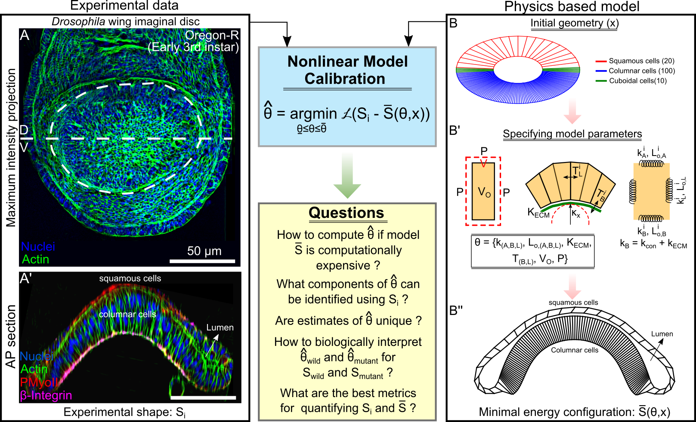

<h1 align="center">Reverse engineering morphogenesis through Bayesian optimization of physics-based models </h1>

  

## Prerequisite Libraries

- Python libraries: Numpy, Pandas, Matplotlib, Seaborn, Plotly, Surrogate Modelling Toolbox (1.0.0), Similarity Measures, Spatial-EFD, GPyTorch (1.5.0), Signac-flow, scikit-learn (0.24.2)
- Modeling environment: Surface Evolver (2.40)
- Supported OS: Linux (Ubuntu (20.0.4))

## Library Description

### A. Parameter Screening

The "parameter-screening" folder contains codes for parameter screening. File management is carried through signac-flow:

1. `init.py`: Initializes Surface Evolver files with parameters sampled using Latin Hypercube Sampling.
2. `main.py`: Runs each file using Surface Evolver. .
3. `signac_to_numpy.ipynb`: Generates `.npy` files from Signac parameter screening data.

### B. Sensitivity Analysis

The "sensitivity-analysis-master" folder contains following:

1. `master_sensitivity_analysis.py`: Generates data for sensitivity measurement. Model parameters are perturbed by 70% of their nominal value. 
2. `sensitivity_analysis.ipynb` calculates sensitivity using finite difference methods.

### C. Bayesian Optimization

The "bayesian-optimization-master" folder contains the main codes for Bayesian optimization:

1. `master_bayesian_optimization.py`: Performs Bayesian optimization to compute parameters of Surface Evolver model that minimized the objective function defined by Frechet distance. Inputs to the model include a text file with xy coordinates of experimental data shape's external contours. The model identifies the 7 listed parameters as shown in Figures 3 and 4 of the manuscript. Estimating other parameters requires generating and training a new GP model and can be achieved through teh parameter-screening codes.
2. `analysis_bayesian_optimization.ipynb`: Analyzes data generated during Bayesian optimization.

### D. Hessian Analysis

The "hessian-analysis-master" folder contains the code to calculate the local hessian for Frechect distance based obsjective function:

1. `master_hessian_analysis.py`: Variates parameters two at a time. Combined with sensitivity analysis data, it generates curvature of the objective function locally.
2. `hessian_analysis.ipynb`: Analyzes the curvature of the objective function, defined the Frechet distance.

## Contact

For inquiries related to the code, please contact:

Nilay Kumar
Multicellular Systems Engineering Lab
Department of Chemical and Biomolecular Engineering
University of Notre Dame, IN
Email: nkumar4@nd.edu